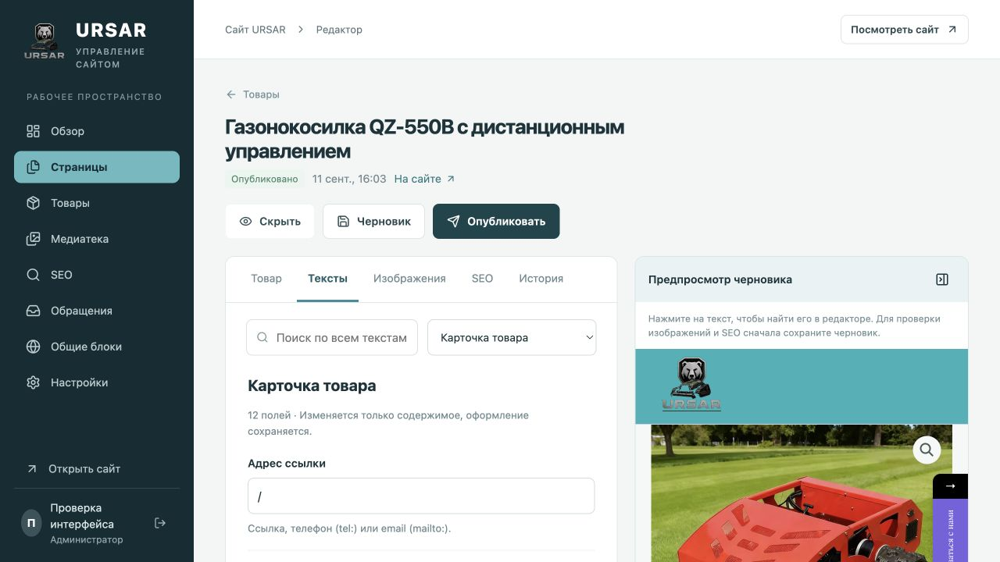
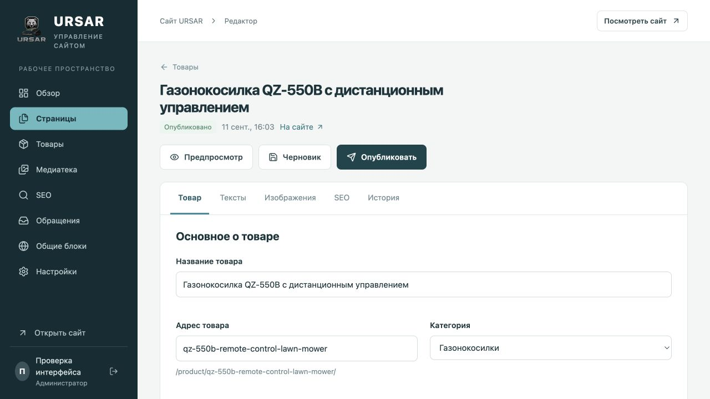
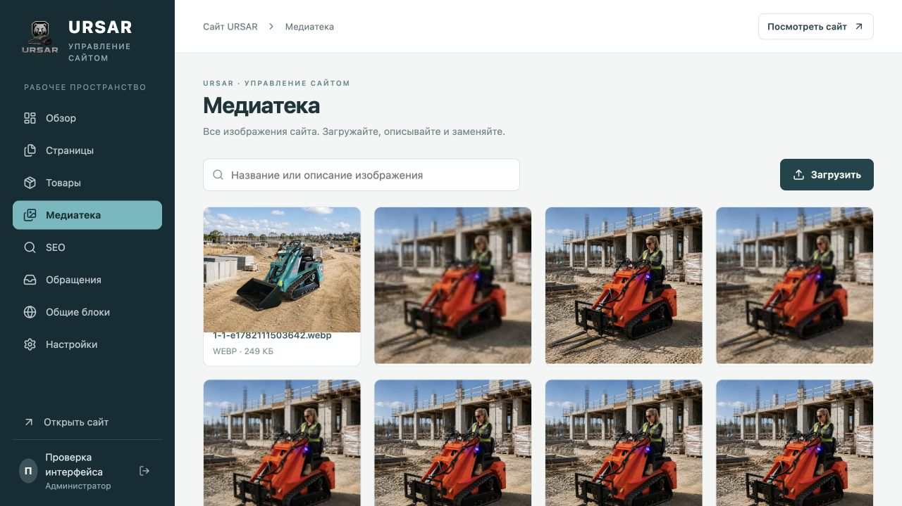
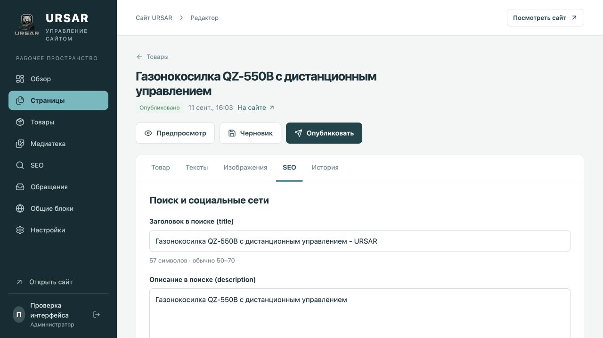
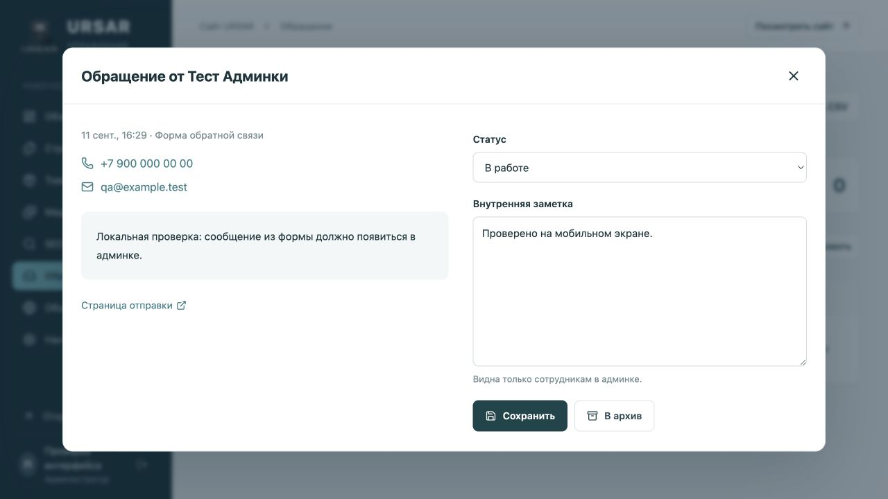

# URSAR: подробная инструкция по админке

Рабочий сайт: [ursar.ru](https://ursar.ru/)
Админка: [ursar.ru/admin/](https://ursar.ru/admin/)

Для владельца сайта, редактора и менеджера обращений.
Версия инструкции: 11 сентября 2026 года.

**Основной порядок:** изменить → сохранить черновик → проверить → опубликовать.

Названия разделов и кнопок сверены с действующим интерфейсом. Иллюстрации сделаны в учебной копии этой же админки. Записи, даты, счётчики и значения настроек на рабочем сайте могут отличаться.

Пароль в инструкцию не включён. Владелец получил его отдельно в файле `URSAR-доступ.txt`. Для первого входа владельца используется email `info@ursar.ru`. Сотрудники входят под своими учётными записями.

## Содержание

1. [Вход и разделы админки](#section-1)
2. [Черновик, предпросмотр и публикация](#section-2)
3. [Как изменить текст страницы](#section-3)
4. [Контакты, меню и общие блоки](#section-4)
5. [Создание, копирование и архив страниц](#section-5)
6. [Редактирование товара](#section-6)
7. [Добавление товара и каталог](#section-7)
8. [Изображение на одной странице](#section-8)
9. [Общая замена и логотип](#section-9)
10. [SEO и карточки ссылок](#section-10)
11. [Обработка обращений](#section-11)
12. [Поиск, архив и CSV обращений](#section-12)
13. [Настройки сайта и форм](#section-13)
14. [Сотрудники, роли и пароли](#section-14)
15. [История и восстановление](#section-15)
16. [Если что-то не получается](#section-16)
17. [Данные и ежедневная памятка](#section-17)

---

## 1. Вход и разделы админки

### Как войти

1. Откройте **https://ursar.ru/admin/**.
2. В поле **«Email»** введите логин своей учётной записи. Для владельца это `info@ursar.ru`. Серый пример `admin@ursar.ru` в пустом поле не является вашим логином.
3. Введите пароль и нажмите **«Войти в админку»**. Значок глаза показывает или скрывает введённые символы.
4. Для выхода нажмите значок выхода рядом со своим именем внизу левого меню.

На телефоне меню открывается кнопкой с тремя полосками. Широкие таблицы можно прокручивать горизонтально. Длинные тексты и галереи удобнее редактировать на компьютере.

### Где что находится

| Раздел | Назначение |
|---|---|
| Обзор | Количества страниц, товаров, изображений и новых обращений; быстрые переходы |
| Страницы | Тексты, ссылки, изображения и публикация отдельных страниц |
| Товары | Модели техники, категории, цена, наличие и галереи |
| Медиатека | Загрузка файлов, подписи и общая замена изображений |
| SEO | Сводная таблица поисковых настроек страниц и товаров |
| Обращения | Заявки из форм, контакты, статусы и внутренние заметки |
| Общие блоки | Шапка, меню, футер и повторяющиеся элементы |
| Настройки | Параметры сайта, формы, сотрудники, пароль и журнал |

**«Посмотреть сайт»** и **«Открыть сайт»** открывают публичную версию. Набор доступных разделов зависит от роли сотрудника. Если пункта меню нет, это может быть ограничением доступа, а не ошибкой.

---

## 2. Черновик, предпросмотр и публикация

**Автосохранения текста нет.** Надпись «Есть несохранённые изменения» означает, что правки пока остаются только в открытом редакторе.

| Кнопка | Что делает |
|---|---|
| Черновик | Записывает правки в базу. Посетители видят предыдущую публикацию |
| Предпросмотр | Показывает черновик. Для достоверной проверки сначала сохраните его |
| Опубликовать | Сохраняет и сразу показывает текущую версию на сайте |
| На сайте | Открывает опубликованную страницу в отдельной вкладке |

### Порядок работы

1. Измените нужные поля.
2. Нажмите **«Черновик»** и дождитесь сообщения «Черновик сохранён».
3. Откройте **«Предпросмотр»** и проверьте результат.
4. Нажмите **«Опубликовать»** и дождитесь подтверждения.
5. Откройте **«На сайте»** и обновите страницу. После заметных изменений проверьте также телефон.

Кнопки вверху сохраняют **всю открытую запись**: тексты, картинки, данные товара и SEO. Это не сохранение только выбранной вкладки. Другие страницы этим действием не публикуются.

### Статусы записей

| Статус | Значение |
|---|---|
| Черновик | Новая запись ещё не опубликована |
| Есть изменения | У опубликованной записи есть изменения в черновике или редакторе |
| Опубликовано | Сохранённая запись совпадает с публичной версией |
| В архиве | Запись убрана из активного списка и с сайта |

**Исключения:** настройки сайта, подпись изображения, статус обращения и данные пользователя применяются сразу после своей кнопки «Сохранить». Архивирование действует сразу после подтверждения. Отдельная публикация для них не нужна.

---

## 3. Как изменить текст страницы

1. Откройте **«Страницы»**. В **«Найти страницу»** введите название или часть адреса.
2. Нажмите нужную запись и выберите вкладку **«Тексты»**.
3. В **«Поиск по всем текстам»** введите часть фразы, которую видите на сайте. Поиск охватывает все блоки этой записи, но не весь сайт.
4. Исправьте найденное поле. Проверьте остальные совпадения: одна фраза может повторяться в разных блоках.
5. Сохраните черновик, проверьте предпросмотр и опубликуйте.

### Найти поле по месту на странице

Откройте предпросмотр и нажмите на нужный текст внутри него. Редактор выберет связанное поле. Если появляется сообщение об общих блоках, переходите в раздел **«Общие блоки»**.

Выпадающий список **«Раздел страницы»** позволяет выбрать блок без поиска. Названия зависят от страницы: например, у товара есть «Карточка товара» и «Подробное описание».

| Поле | Что меняется |
|---|---|
| Заголовок H1/H2, Текст | Видимый текст. Вводите обычный текст, без HTML-кода |
| Текст ссылки | Надпись на кнопке или пункте меню |
| Адрес ссылки | Куда ведёт нажатие; надпись не меняет этот адрес автоматически |
| Исходный текст | Возврат к первоначальному содержимому поля из импортированной копии |

**«Исходный текст» не отменяет последнюю правку.** Для возврата к предыдущей сохранённой версии используйте вкладку «История».

Оформление блока сохраняется, но более длинный текст может занять больше строк. Если надпись нарисована внутри фотографии, поиск по текстам её не найдёт: потребуется заменить изображение.

*Вкладка «Тексты» и предпросмотр в учебной копии.*

---

## 4. Контакты, меню и общие блоки

Раздел **«Общие блоки»** меняет повторяющиеся элементы сайта. Копии контактов внутри отдельных страниц, например на странице контактов, проверяйте отдельно.

### Пример: сменить телефон

1. Откройте **«Общие блоки» → «Тексты»** и найдите старый номер или его часть.
2. В видимом тексте укажите номер в удобном формате: `+7 926 757 79 79`.
3. В связанном поле **«Адрес ссылки»** укажите `tel:+79267577979`, без пробелов.
4. Проверьте остальные совпадения. Сохраните черновик и опубликуйте.
5. Откройте страницу контактов через «Страницы» и при необходимости обновите номер там.
6. Нажмите телефон на опубликованном сайте и проверьте предлагаемый номер для звонка.

### Email, адрес и WhatsApp

| Что меняете | Как заполнять |
|---|---|
| Email | Видимый текст: `info@ursar.ru`; адрес ссылки: `mailto:info@ursar.ru` |
| Юридический адрес | Замените полный текст; проверьте футер и страницу контактов |
| WhatsApp | Найдите `whatsapp` или старый номер без пробелов; в существующей ссылке замените значение `phone=` на цифры с кодом страны |

Сохраните дополнительные параметры существующей ссылки WhatsApp. Изменение телефона в тексте не обновляет WhatsApp автоматически.

### Пример: переименовать пункт меню

1. В общих блоках найдите старую надпись.
2. Измените **«Текст ссылки»** и, если требуется, **«Адрес ссылки»**.
3. Для главной используйте `/`, для витрины «Каталог» - `/product-show/`, для списка всех товаров «Магазин» - `/shop/`.
4. Проверьте повторы в шапке, футере и мобильном меню.
5. Опубликуйте и нажмите изменённые пункты на сайте.

**Публикуется весь черновик общих блоков.** Вместе с телефоном могут примениться ранее сохранённые правки меню или общие замены изображений. Перед публикацией проверьте, что все они готовы.

---

## 5. Создание, копирование и архив страниц

### Создать страницу

1. Откройте **«Страницы» → «Создать страницу»**.
2. Заполните **«Название»**, например «Доставка».
3. В **«Адрес»** введите только новую часть пути: `dostavka`. Используйте строчные латинские буквы, цифры и дефисы; без пробелов и слешей.
4. В **«Взять оформление страницы»** выберите существующую страницу с подходящими блоками.
5. Нажмите **«Создать черновик»**.
6. Замените тексты, ссылки и изображения шаблона, заполните SEO, проверьте предпросмотр.
7. Нажмите **«Опубликовать»**. Страница будет доступна, например, по `/dostavka/`.

Новая страница **не добавляется в меню автоматически**. Измените ссылку существующего пункта или кнопки. Добавление новых пунктов сверх текущей структуры меню требует доработки оформления.

### Сделать копию

В строке записи нажмите значок **«Дублировать»**. Задайте название и уникальный адрес, нажмите **«Создать черновик»**. Копируется содержимое черновика оригинала, поэтому проверьте и его неопубликованные правки.

### Изменить действующий адрес

Откройте запись → **«SEO» → «Адрес страницы»**. Здесь вводится полный путь со слешами: `/dostavka/`. После публикации для старого адреса опубликованной записи создаётся перенаправление. Вручную заданный нестандартный канонический адрес проверьте отдельно.

### Убрать страницу и вернуть

1. В строке нажмите **«В архив»** и подтвердите. Страница сразу перестанет открываться посетителям; старые ссылки могут вести на 404.
2. Для возврата выберите фильтр **«Архив»** и нажмите **«Восстановить»**.
3. Если запись была опубликована, снова станет доступна последняя публикация. Если это был только черновик, его ещё нужно опубликовать.

Главную страницу и общие блоки архивировать нельзя. Архив сохраняет запись; безвозвратного удаления страниц в интерфейсе нет.

---

## 6. Редактирование товара

Откройте **«Товары»**, найдите модель через **«Найти товар»** и нажмите название. Выберите вкладку **«Товар»**.

| Поле | Как заполнять |
|---|---|
| Название товара | Полное название модели |
| Адрес товара | Часть после `/product/`, например `qz-550b`. Действующие пути без необходимости не меняйте |
| Категория | «Газонокосилки» или «Мини-погрузчики» |
| Цена, ₽ | Число без знака рубля. Пустое поле означает цену по запросу; `0` не равен пустому полю |
| Наличие | «По запросу», «В наличии», «Под заказ» или «Нет в наличии» |
| Краткое описание | Основной текст рядом с фотографиями |

### Галерея

1. Прокрутите до **«Галерея товара»** и нажмите **«Добавить фото»**.
2. Выберите изображение из медиатеки или загрузите новое.
3. Кнопками **«Левее»** и **«Правее»** расставьте фото. Первое помечено **«Главное»** и используется в списке товаров.
4. **«Убрать из галереи»** исключает фото из товара, но не удаляет файл из медиатеки.
5. Сохраните черновик, проверьте и опубликуйте.

Подробное описание и характеристики редактируются на вкладке **«Тексты»**. Если характеристики встроены в картинку, заменяйте её через **«Изображения»**. Для названия и краткого описания используйте прежде всего вкладку «Товар».

После смены названия проверьте SEO-заголовок и карточку ссылки: заполненные SEO-поля не переписываются автоматически. Цена и наличие являются данными каталога; они не подключают онлайн-оплату.

*Редактор существующей модели. Кнопки сохранения относятся ко всем вкладкам записи.*

---

## 7. Добавление товара и каталог

### Новый товар: от шаблона до публикации

1. Откройте **«Товары» → «Добавить товар»**.
2. Введите название и уникальный адрес, например `ursar-qz-new`. Это пример пути, а не реальная модель.
3. Выберите **«Взять оформление страницы»**: подходящую газонокосилку или мини-погрузчик.
4. Нажмите **«Создать черновик»**.
5. Во вкладке **«Товар»** проверьте название, категорию, цену, наличие и краткое описание.
6. Добавьте галерею, поставьте главное фото первым.
7. Во вкладке **«Тексты»** замените характеристики, упоминания старой модели, подробное описание и ссылки.
8. Во вкладке **«Изображения»** проверьте унаследованные баннеры и таблицы. Заполните **«SEO»**, включая обложку ссылки.
9. Сохраните **«Черновик»**, проверьте предпросмотр и нажмите **«Опубликовать»**.
10. Откройте товар, магазин и категорию: проверьте название, изображение и переход.

**Шаблон содержит исходное наполнение.** Новый товар не очищает автоматически все подробные блоки и иллюстрации. До публикации уберите данные другой модели.

Для близкой модификации используйте **«Дублировать»** в строке товара. В копию попадёт черновик оригинала. Измените адрес и отличающиеся параметры; проверьте все вкладки.

### Где появляется товар

| Страница | Поведение |
|---|---|
| Магазин `/shop/` | Автоматический список опубликованных товаров |
| Страницы категорий | Состав зависит от категории товара |
| Каталог `/product-show/` | Отдельная витрина с исходными блоками; редактируется через «Страницы» |

Новая модель не добавляется автоматически во все оформительские блоки витрины `/product-show/`. Чтобы скрыть модель из динамического списка, используйте архив в «Товарах». После восстановления вернётся последняя публикация.

Новые категории, произвольные секции и дополнительные структурные поля сейчас не создаются через интерфейс: для них нужна доработка.

---

## 8. Изображение на одной странице

Используйте этот способ, чтобы заменить фото или баннер **только здесь**, сохранив его в остальных местах.

1. Откройте страницу или товар → **«Изображения»**.
2. В блоке изображений этой страницы нажмите нужную картинку.
3. В **«Выберите изображение»** выберите готовый файл или нажмите **«Загрузить»** и укажите файл на компьютере.
4. После загрузки нажмите нужную миниатюру в медиатеке.
5. В окне **«Замена на этой странице»** обычно оставьте **«Заменить также уменьшенные версии»**: это нужно для разных размеров экрана.
6. Нажмите **«Применить в редакторе»**.
7. Сохраните **«Черновик»**, проверьте предпросмотр и **«Опубликовать»**.

В списке может остаться исходная миниатюра с пометкой **«Есть замена»**. Результат проверяйте в сохранённом предпросмотре и на сайте.

### Требования к файлам

| Параметр | Ограничение |
|---|---|
| Форматы | JPEG, PNG, WebP и GIF |
| Размер | До 15 МБ на файл |
| Разрешение | До 25 мегапикселей, например 5000 × 5000 пикселей |
| Хранение | Загруженные изображения преобразуются в WebP |
| GIF | Сохраняется первый кадр, без анимации |
| SVG и PDF | Новые файлы этих форматов через медиатеку не загружаются |

Выбирайте похожие пропорции: горизонтальный баннер заменяйте горизонтальной картинкой. Иначе существующий блок может обрезать важную часть. Для логотипа без фона подготовьте PNG или WebP с прозрачностью.

**Загрузка не равна размещению:** после загрузки файл ещё нужно выбрать, применить и опубликовать. Медиатека сама не удаляет фон и не переводит надписи внутри фотографий. Для основной галереи товара используйте «Галерея товара».

---

## 9. Общая замена и логотип

Общая замена меняет все места использования **выбранного исходного файла**, а не все визуально похожие изображения.

1. В **«Медиатеке»** найдите исходный файл по названию или описанию и нажмите на него.
2. При необходимости раскройте **«Используется на … страницах»**.
3. В блоке **«Заменить на сайте»** нажмите **«Выбрать замену»**.
4. Выберите или загрузите новое изображение и нажмите его миниатюру.
5. Оставьте **«Заменить также уменьшенные версии»**, если меняете всё изображение.
6. Нажмите **«В черновик»** для проверки либо **«Опубликовать замену»** для применения.
7. При сохранении в черновик откройте **«Общие блоки»**, проверьте предпросмотр и опубликуйте их.
8. Проверьте несколько страниц и мобильную версию.

**«Опубликовать замену» публикует весь черновик общих блоков**, включая сохранённые тексты и меню. Замена, заданная отдельно на конкретной странице, имеет приоритет над общей.

### Пример: логотип

Найдите в медиатеке `ursar`, откройте используемый логотип, например `ursar-transparent.svg`, и проверьте оригинал. Замените подготовленным PNG/WebP с прозрачностью. Проверьте шапку и футер: если они используют разные исходные файлы, замените оба.

Размер блока логотипа задаётся оформлением. Большие пустые поля внутри файла визуально уменьшают знак; замена картинки не меняет ширину и высоту самого блока.

### Название и alt

В карточке измените **«Название файла»** и **«Описание изображения (alt)»**, затем нажмите **«Сохранить подпись»**. Это действует сразу. Название помогает находить файл, но не меняет его технический адрес. Alt кратко описывает изображение; например: «Газонокосилка URSAR QZ-550B, вид спереди».

Оригинал остаётся в библиотеке. Для возврата можно выбрать его снова; для отката набора общих замен используйте «Историю» общих блоков.

*Медиатека: поиск, загрузка и выбор существующих ресурсов.*

---

## 10. SEO и карточки ссылок

Откройте **«SEO»** в меню и нажмите страницу либо выберите вкладку **«SEO»** в её редакторе.

| Поле | Назначение |
|---|---|
| Заголовок в поиске (title) | Заголовок для поисковых систем и вкладки браузера |
| Описание в поиске (description) | Краткое описание страницы; при пустом поле используется общее |
| Канонический адрес | Основной адрес страницы. Обычно текущий путь или пустое поле для автоматического адреса |
| Запретить индексацию этой страницы | Просьба поисковикам не включать страницу в выдачу |
| Заголовок и описание карточки | Тексты предпросмотра ссылки в мессенджерах |
| Выбрать обложку | Картинка карточки ссылки из медиатеки |

### Пример настройки товара

1. В title укажите модель и бренд: «Газонокосилка URSAR QZ-550B с дистанционным управлением».
2. В description кратко опишите именно эту модель. Не копируйте параметры другой техники.
3. Проверьте канонический адрес: не оставляйте старый домен или GitHub-демонстрацию.
4. Заполните карточку ссылки и выберите обложку.
5. Сохраните черновик и **«Опубликовать»**.

Подсказки интерфейса о длине title и description помогают оценить размер текста. Макет в редакторе - пример, а не гарантия вида поисковой выдачи. Внешние сервисы могут обновлять карточку не сразу.

### Индексация

Общий переключатель: **«Настройки» → «Сайт и формы» → «Запретить индексацию всего сайта»**. Общий запрет имеет приоритет над разрешением отдельной страницы.

При передаче ursar.ru открыт для индексации; админка и служебные кабинеты покупателей закрыты. GitHub Pages закрыт независимо от настроек рабочего сайта. Карта **https://ursar.ru/sitemap.xml** формируется из опубликованных данных.

Запрет индексации не заменяет пароль и не делает публичную страницу приватной.

*Вкладка SEO. Значения учебной копии могут отличаться от настроек рабочего сайта.*

---

## 11. Обработка обращений

Сюда поступают сообщения основной и боковой форм сайта. Сообщения, отправленные напрямую в WhatsApp или обычную почту, автоматически не импортируются.

### Обработать новую заявку

1. Откройте **«Обращения»** и нажмите **«Обновить»**.
2. Нажмите карточку **«Новое»** либо выберите этот статус в фильтре.
3. Откройте строку посетителя. Проверьте контакты, текст, время, название формы и **«Страница отправки»**.
4. Выберите **«В работе»**, заполните **«Внутреннюю заметку»**, нажмите **«Сохранить»**.
5. Свяжитесь по телефону или email. Нажатие контакта открывает соответствующее приложение на вашем устройстве.
6. Снова откройте обращение и допишите результат разговора и следующий шаг.
7. После завершения выберите **«Закрыто»** и сохраните.

| Статус | Значение |
|---|---|
| Новое | Обращение ещё не обработано |
| В работе | Уточняются детали, готовится ответ или предложение |
| Закрыто | Работа завершена |
| Спам | Нецелевое или нежелательное сообщение |

**Открытие карточки не меняет статус автоматически.** Нужны выбор статуса и «Сохранить». Заметка видна сотрудникам и не отправляется клиенту. Это одно общее поле: дописывайте дату и результат, если хотите сохранить предыдущие записи внутри него.

Почтовые уведомления и отправка ответов из админки пока не подключены. Регулярно проверяйте раздел и отвечайте через телефон или почтовое приложение.

*Учебное обращение: контакты, статус, внутренняя заметка и сохранение.*

---

## 12. Поиск, архив и CSV обращений

### Найти клиента

В поле **«Имя, телефон, email или текст»** введите известную часть данных. Если телефон не находится из-за пробелов или скобок, попробуйте последние цифры либо имя. Для поиска по всем активным заявкам выберите **«Все обращения»**.

Верхние карточки показывают общие количества активных заявок по статусам. Поиск может оставить в таблице меньше строк. Если заявка не видна, очистите поиск, снимите фильтр, нажмите «Обновить», затем отдельно проверьте архив.

### Архивировать и вернуть

1. В карточке нажмите **«В архив»**. Заявка исчезнет из активного списка; выбранный статус и заметка тоже сохранятся.
2. Выберите **«Архив»** в фильтре для просмотра убранных записей.
3. Откройте запись и нажмите **«Вернуть»**. Она вернётся с сохранённым статусом.

**«Закрыто» и архив - разные вещи.** Закрытая заявка остаётся в активном списке. «Спам» тоже не удаляет запись. Безвозвратного удаления обращений в интерфейсе нет.

### Выгрузить CSV

Нажмите **«Выгрузить CSV»**. Файл содержит дату, имя, телефон, email, сообщение, статус, заметку и страницу отправки.

**Выгружаются все обращения вне архива**, а не только результат поиска, выбранный статус или первая страница. Закрытые и спам-заявки также попадут в файл, если они не архивированы.

Формат: UTF-8, разделитель `;`. Если табличный редактор открыл всё в одной колонке, используйте импорт CSV с этими параметрами. Статусы в файле: `new` - новое, `working` - в работе, `closed` - закрыто, `spam` - спам. Перед некоторыми значениями, включая телефон с `+`, может быть защитный апостроф; это не изменение исходного контакта.

### Проверить форму

Откройте опубликованные контакты на ursar.ru, заполните форму своим контактом, сообщением «Тест формы» и согласием. После сообщения об успехе найдите заявку в админке. В предпросмотре отправка отключена, а GitHub-демонстрация заявки не сохраняет.

---

## 13. Настройки сайта и форм

**«Настройки» → «Сайт и формы»** доступны администратору. Кнопка **«Сохранить настройки»** применяет изменения сразу.

| Настройка | Что меняется |
|---|---|
| Название сайта | Имя в служебных данных и автоматических SEO-значениях. Не заменяет бренд во всех текстах |
| Описание по умолчанию | Запасное SEO-описание для страниц с пустым собственным описанием |
| Запретить индексацию всего сайта | Общий запрет для рабочего сайта |
| Сообщение после отправки | Текст после успешного сохранения заявки |
| Текст согласия на обработку данных | Подпись согласия рядом с формой |

### Пример: изменить сообщение после отправки

1. Найдите **«Сообщение после отправки»**.
2. Введите, например: «Спасибо! Мы получили ваше обращение и свяжемся с вами в рабочее время».
3. Нажмите **«Сохранить настройки»** и дождитесь подтверждения.
4. Обновите публичную страницу перед проверкой формы.

Подпись согласия не изменяет автоматически политику конфиденциальности. Сам текст политики редактируется через «Страницы», путь `/privacy-policy-2/`. Названия форм и подписи полей ищите в текстах соответствующей страницы или общих блоках. Добавление полей формы требует доработки.

### Экспорт содержимого

В блоке **«Экспорт содержимого»** нажмите **«Скачать JSON»**. В файл входят страницы, товары, SEO, настройки и сведения об изображениях.

JSON **не включает** пароли, обращения и сами файлы фотографий. Это не полная резервная копия. Кнопки обратного импорта JSON в этой версии нет; восстановление из такого файла выполняет специалист.

### Журнал действий

Откройте **«Настройки» → «Журнал действий»**, чтобы увидеть последние зарегистрированные операции, сотрудника и время. Для восстановления текста используйте «Историю» конкретной страницы, а не журнал.

---

## 14. Сотрудники, роли и пароли

| Роль | Доступ |
|---|---|
| Администратор | Все разделы, сотрудники, настройки, контент и обращения |
| Редактор | Страницы, товары, медиатека, SEO и общие блоки; без обращений и пользователей |
| Менеджер обращений | Работа с обращениями; без редактирования контента и настроек сайта |

Все сотрудники могут менять свой пароль. Отдельные учётные записи позволяют видеть конкретного исполнителя в журнале.

### Добавить сотрудника

1. Откройте **«Настройки» → «Пользователи» → «Добавить пользователя»**.
2. Заполните **«Имя»** и **«Email для входа»**.
3. Выберите роль.
4. Задайте **«Начальный пароль»**: минимум 12 символов, максимум 72 байта. Для удобного ввода используйте латинские буквы, цифры и знаки.
5. Нажмите **«Сохранить»**. Передайте ссылку, логин и пароль сотруднику отдельно.

Письмо-приглашение автоматически не отправляется. Приглашение в GitHub и учётная запись админки - разные доступы.

### Изменить или отключить доступ

Нажмите **«Изменить»** напротив пользователя. Можно поменять имя, роль, пароль или снять **«Доступ активен»**, затем сохранить. Пустое поле нового пароля сохраняет текущий. Email существующей записи в этой форме не редактируется.

Отключение закрывает доступ. Свою роль и активность здесь изменить нельзя. Если сотрудник забыл пароль, администратор задаёт ему новый; самостоятельного восстановления через письмо нет.

### Изменить свой пароль

Откройте **«Настройки» → «Мой пароль»**, введите текущий пароль, новый и повтор нового, нажмите **«Изменить пароль»**. Другие сеансы этой учётной записи завершатся.

Если пароль потерял единственный администратор, восстановление выполняет специалист через серверную команду. Пароль от Beget не является паролем от админки.

---

## 15. История и восстановление

История есть у страниц, товаров и общих блоков. Она помогает вернуть сохранённую версию после неудачных правок.

### Вернуть предыдущую версию

1. Откройте запись → **«История»**.
2. Найдите версию по времени, сотруднику и типу события: исходная версия, сохранённый черновик или публикация.
3. Нажмите **«Восстановить»** и подтвердите действие.
4. Версия появится **в черновике**. Публичная версия пока не изменится.
5. Проверьте тексты, изображения, товар и SEO. Откройте предпросмотр.
6. Чтобы применить возврат на сайте, нажмите **«Опубликовать»**.

Восстанавливается вся запись, а не одно поле. Несохранённые правки открытого редактора будут заменены; предварительно скопируйте их отдельно, если они нужны.

**«Исходный текст»** под полем возвращает первоначальный текст из импортированной копии. **«История»** возвращает сохранённую версию целой страницы. Для отмены недавней публикации используйте историю.

В интерфейсе показываются до 100 последних версий записи. История контента не восстанавливает пользователей, обращения и общие настройки и не заменяет резервную копию базы.

### Одновременная работа сотрудников

Если другой сотрудник уже сохранил запись, ваша попытка сохранения может остановиться с сообщением о конфликте версий.

1. Не обновляйте страницу, пока не скопировали свои новые тексты отдельно.
2. Уточните у коллеги, что он менял.
3. Заново откройте запись и загрузите актуальные данные.
4. Внесите свои правки поверх них и сохраните.

Общие блоки также используются общей заменой изображений. По возможности не редактируйте их одновременно. Для заметок обращений и карточек пользователей аналогичного объединения изменений нет: договоритесь, кто ведёт запись.

---

## 16. Если что-то не получается

| Ситуация | Действие |
|---|---|
| Не удаётся войти | Проверьте свой email, раскладку, Caps Lock, пробелы и активность учётной записи |
| Сессия завершена | Скопируйте несохранённый текст, если ещё виден; войдите снова |
| Нет нужного раздела | Проверьте роль: у редактора и менеджера разные возможности |
| На сайте старый текст | Нажмите «Опубликовать», откройте ursar.ru, а не GitHub, обновите страницу |
| Поиск не находит фразу | Проверьте общие блоки, другую страницу или текст внутри картинки |
| Подпись кнопки новая, переход старый | Измените отдельно «Адрес ссылки» и опубликуйте |
| Номер новый, звонок на старый | Проверьте ссылку `tel:`. WhatsApp меняется отдельно |
| Картинка загружена, но не изменилась | Выберите её как замену, примените и опубликуйте; для товара проверьте галерею |
| На телефоне старая картинка | Проверьте уменьшенные версии и отдельную замену на этой странице |
| Картинка обрезана или логотип мелкий | Проверьте пропорции и пустые поля файла. Размер блока задан оформлением |
| Файл не загружается | JPEG/PNG/WebP/GIF до 15 МБ и 25 Мп; уменьшите слишком большой файл |
| Новый товар не виден в витрине | Проверьте публикацию, архив, магазин и категорию. Витрина `/product-show/` редактируется отдельно |
| Внешняя карточка ссылки старая | Проверьте опубликованные SEO-поля; сервис может хранить предыдущую карточку |
| Не видно заявки | Обновите список, снимите фильтры, проверьте архив и отправку именно на рабочем сайте |
| Сохранение отклонено | Прочитайте ошибку: возможны занятый адрес, неверная ссылка или конфликт версий. Скопируйте правки перед повторным открытием |

Если проблема остаётся, передайте специалисту адрес страницы, раздел админки, точный текст ошибки, время и предшествующие шаги. На скриншотах обращений закройте ненужные личные данные клиента. Пароли в описание проблемы не включайте.

---

## 17. Данные и ежедневная памятка

### Каким сайтом управляет админка

- **ursar.ru на Beget** - рабочий сайт. Здесь сохраняются правки, фотографии, пользователи и обращения.
- **GitHub, ветка main** - исходный дизайн, код и документация. Правки через админку не создают коммит автоматически.
- **GitHub Pages, ветка gh-pages** - статическая демонстрация. Она не получает правки CMS автоматически и не сохраняет заявки.

Для обычного изменения текста и товара заходить в Beget или GitHub не нужно. Используйте админку и «Опубликовать».

### Резервные копии

Для полного восстановления нужны база, загруженные изображения и конфигурация. Экспорт JSON содержит не всё. При развёртывании копия базы создана, но автоматическое расписание самим приложением не настроено. Регулярные копии и восстановление выполняются средствами хостинга или специалистом; техническая инструкция находится в `docs/DEPLOYMENT.md` репозитория.

### Памятка редактора

1. Выберите правильную запись; проверьте, не относится ли блок ко всему сайту.
2. Измените контент; у ссылки проверьте и надпись, и адрес.
3. Сохраните черновик и проверьте предпросмотр.
4. Опубликуйте, проверьте компьютер и телефон.
5. При ошибке восстановите версию через историю и опубликуйте её.

### Памятка менеджера

1. Откройте обращения и нажмите «Обновить».
2. Разберите новые заявки, отметьте «В работе» и сохраните.
3. Свяжитесь с клиентами, допишите результат и следующий шаг.
4. Закройте завершённые обращения; архивируйте при необходимости.

### Границы интерфейса

Админка управляет содержимым в существующем оформлении. Произвольные секции, сетка, размеры шрифта и сложный дизайн требуют доработки. Надписи внутри фото меняются заменой изображения.

Приём обращений работает. Уведомления по email, ответы из админки, онлайн-оплата, полноценный кабинет покупателя, бронирование и обработка старых отзывов не подключены; для них нужна отдельная настройка или разработка.
